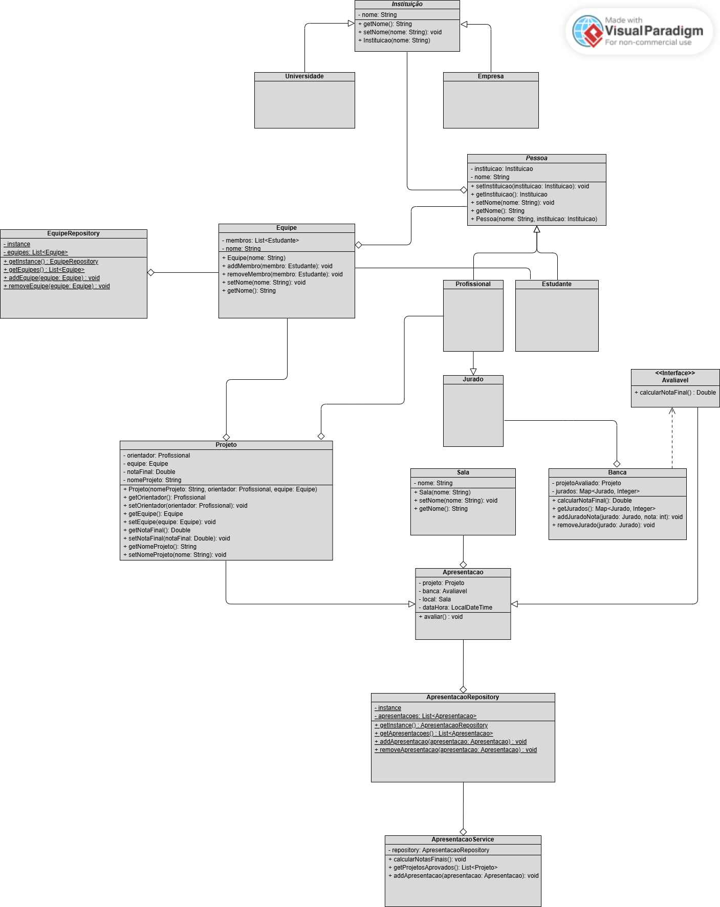

# hackathon-modular-dev
Hackathon Modular Dev é um projeto acadêmico desenvolvido como parte das atividades da faculdade. O objetivo principal é aplicar os conceitos de programação modular, modelagem orientada a objetos e boas práticas de estruturação de código em Java.

O sistema simula a organização de um hackathon, permitindo o gerenciamento de equipes, projetos e apresentações, utilizando o padrão Singleton para coleções centralizadas.

## 💡 Objetivo

Simular a estrutura de um hackathon com foco em modularidade, permitindo:

- Cadastro de equipes participantes
- Associação de projetos às equipes
- Agendamento de apresentações
- Gerenciamento centralizado por meio de classes Singleton
- 
## 🧠 Estrutura do Projeto

## 👨‍🎓 Desenvolvido por
Kayke Emanoel de Souza Santos • PUC-Minas — 2025